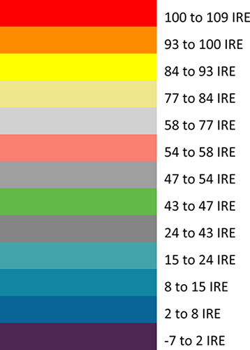
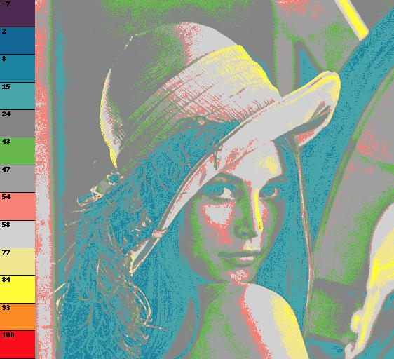

# FalseColor

A simply command line python program that generates a false color image of an input image. False color makes it easier to check the exposure of different parts of an image.



## Example

```
python falseColor.py lena.bmp --save --nodisplay --legend
```

| input | output |
|---|---|
|   |    |


## Dependencies

- [Pillow: Python Imaging Library (Fork)](https://github.com/python-pillow/Pillow)

install with __pip__:

```
pip install Pillow
```